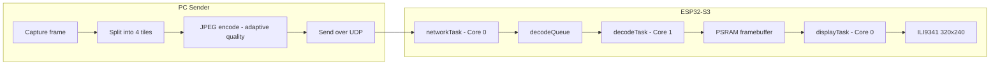

# S3 Next-Gen JPEG Stream

**A wireless, real-time video display built from scratch on an ESP32-S3 — no capture card, no HDMI, just WiFi, a $10 SPI TFT, and a hand-tuned dual-core decode pipeline pushing full-motion video at up to 35 FPS.**

<!--
  DROP YOUR MEDIA HERE — this is the first thing anyone sees.
  A short GIF or MP4 of the panel actually playing something (a game clip,
  a music video, whatever) sells this project in 3 seconds better than any
  paragraph below can. Recommended: a screen recording of the panel next to
  the source video playing on your PC, so people can see it's live.

  
-->


---

## What is this?

A PC captures your screen (or plays back any video source), slices each frame into 4 tiles, JPEG-encodes them, and streams them over WiFi (UDP) to an ESP32-S3. The S3 reassembles, decodes, and pushes each frame straight to a 320×240 SPI TFT over DMA — no cable, no dedicated streaming hardware, just a microcontroller doing real-time video decode on its own.

It started as a simple "mirror my screen to a small display" idea and turned into a genuinely engineered pipeline: a 4-slot parallel decode pipeline across both CPU cores, PSRAM-backed ping-pong framebuffers, an auto-adapting quality controller that reacts to network conditions in real time, self-healing frame recovery when decode falls behind, and OTA wireless firmware updates so you never have to touch a USB cable after the first flash.

## Highlights

- **Real-time wireless video** — 320×240 @ up to 35 FPS, decoded and displayed live, entirely over WiFi.
- **Adaptive bitrate — the single biggest quality-of-life feature here.** The PC-side sender watches its own output size every single frame and throttles JPEG quality up or down in real time to stay under a target byte budget. Scene gets more complex, network gets congested, ESP falls behind — quality eases down automatically before it ever turns into stutter or a backlog, then climbs back up the moment there's headroom again. Runs in **Auto** mode by default with zero input from you; flip to **Manual** in the control UI any time you want to lock quality yourself and drive it directly.
- **Tile-parallel decode pipeline** — each frame is split into 4 independently-streamed JPEG tiles, reassembled and decoded through a 4-slot SRAM pipeline so the decoder never idles waiting on the network.
- **Dual-core FreeRTOS architecture** — Core 0 owns networking, display DMA, and OTA; Core 1 is dedicated entirely to decode. Fully task-based, no reliance on the Arduino framework's implicit loop.
- **Self-healing frame recovery** — if a tile fails to decode or arrive in time (network hiccup, decoder falling behind under load), the pipeline falls back to the last known-good pixels for just that tile instead of showing corrupted or torn video.
- **Zero-copy decode path** — JPEG MCUs are decoded directly into the display framebuffer in the panel's native pixel format; no intermediate scratch buffer, no byte-swap pass.
- **OTA wireless updates** — reflash the firmware over WiFi after the first USB flash; no physical access needed.
- **Live diagnostics** — the ESP streams back FPS, decode time, per-core CPU load, temperature, memory headroom, and drop/abort counters, rendered as an on-screen debug overlay on the PC sender.

## How it works



(`otaTask` and `wifiWatchdogTask` also run on Core 0 alongside `networkTask` and `displayTask` — left out of the diagram to keep it readable; see [`HARDWARE.md`](HARDWARE.md) for the full task/core breakdown.)

Each of the 4 tiles is chunked over UDP, reassembled on the ESP, and handed to a dedicated decode task on Core 1 that writes decoded pixels directly into a PSRAM framebuffer. Once all 4 tiles for a frame land, Core 0's display task fires a single DMA transfer to the panel — the CPU touches zero pixels during the actual push. See [`HARDWARE.md`](HARDWARE.md) for the full pin-level wiring and memory budget.

## Hardware

| | |
|---|---|
| MCU | ESP32-S3 (dual-core, 16 MB flash, 8 MB PSRAM) |
| Display | ILI9341, 320×240, SPI (80 MHz write clock) |
| Link | WiFi 802.11n |

Full pinout, SPI bus configuration, and memory budget: **[`HARDWARE.md`](HARDWARE.md)**.

## Getting started

Requires [PlatformIO](https://platformio.org/).

**Before your first flash**, open [`src/nexus.h`](src/nexus.h) — it's the one file you need to edit. Zone 1 at the top has your WiFi credentials and display pin wiring; nothing else in the codebase needs to be touched to get this running on your own network and hardware.

```bash
# First flash — wired, over USB
# (uncomment upload_protocol = esptool in platformio.ini first)
pio run -t upload

# All subsequent flashes — wireless OTA
# (default configuration: upload_protocol = espota)
pio run -t upload
```

The PC-side sender lives in `captureJpeg.py`:

```bash
pip install -r requirements.txt
python captureJpeg.py
```

It auto-discovers any ESP32-S3 running this firmware on the local network and starts streaming automatically — no IP address to type in, no config to edit.

A control window opens per discovered ESP with five self-explanatory sliders:

| Control | What it does |
|---|---|
| `Mode (0=Auto 1=Manual)` | Auto = adaptive bitrate manages quality for you (default). Manual = you set it directly. |
| `Manual Quality` | JPEG quality, only used in Manual mode. |
| `Sharpen` | Optional edge sharpening, 0 = off. |
| `Show Stats` | Toggles the live performance overlay (FPS, decode time, CPU load, temps, memory, drops) on top of the preview. |
| `Monitor` | Which screen to capture, if you have more than one. |

Frame rate and chroma subsampling aren't exposed as controls on purpose — they're fixed (35 FPS send rate, 4:2:0 chroma) because there was no real reason to make them user-tunable, and fewer knobs means less to get wrong.

## Project structure

```
src/
  nexus.h             ← start here — WiFi, pins, and every other setting, zoned by priority
  main.cpp            entry point, task orchestration, decode task
  network.cpp/.h      UDP receive, tile chunk reassembly, WiFi watchdog
  jpeg_decode.cpp/.h  per-tile JPEG decode → PSRAM framebuffer
  display.cpp/.h      LovyanGFX panel driver, DMA display task
captureJpeg.py         PC-side capture / encode / send + live control UI
requirements.txt       Python dependencies (pip install -r requirements.txt)
HARDWARE.md            pin wiring, SPI config, memory budget
```

`src/nexus.h` is the single file everything else in the firmware connects through — every WiFi credential, pin number, buffer size, and timeout lives there, organized into zones by how likely you are to need to touch it: Zone 1 is "edit this before you flash," Zone 2 is "change this if your hardware setup differs," Zone 3 is timing tunables, and Zone 4 is internal plumbing (structs, FreeRTOS handles) that the rest of the firmware depends on but you shouldn't need to edit.

## Known limitations

Being upfront about where this stands today:

- **Single antenna, no MIMO** — WiFi throughput is bounded by the ESP32-S3's single spatial stream; real-world sustained bandwidth is well below the on-paper PHY rate.
- **Decode cost scales with scene complexity** — high-motion, high-detail source content (fast video, not static UI) is the worst case for JPEG's decode cost; frame rate can dip under sustained heavy load. This is a known, actively-investigated tradeoff, not an oversight.
- **Intra-frame only** — every frame is independently encoded; there's no motion compensation or delta encoding between frames. Deliberate: for genuinely high-motion content this trades little in practice, and keeps the pipeline simple and glitch-resistant.
- **No hardware video decode block** — the ESP32-S3 doesn't have one, so all of this is running on general-purpose CPU cycles. That's the ceiling this whole project is built around.

## License

<!-- Pick one: MIT is the common default for hobby/embedded projects like this. -->
